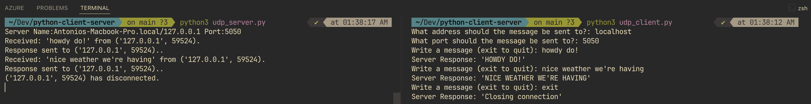

# Client-Server Network

A lightweight, concurrent Python server using **UDP**, **TCP** and **Threading**. This project is built with a request-response architecture that allows multiple clients to communicate with the server simultaneously.




## Features
*   **UDP Protocol:** Connectionless, low-latency communication.
*   **Multi-threaded:** Handles multiple client requests concurrently.
*   **Remote Shutdown:** Secret command for shutting down server 👀.

## Requirements
*   Python 3.x

## Installation & Usage

1.  **Clone the repository:**
    ```bash
    git clone https://github.com/yourusername/your-repo-name.git
    cd your-repo-name
    ```

2.  **Start the Server:**
    ```bash
    python3 udp_server.py / python3 tcp_server.py

```

3.  **Run a Client:**
    ```bash
    python3 udp_client.py / python3 tcp_client.py
    ```

## Commands
*   **exit**: Closes the specific client session.
*   **Any other text**: Server returns a modified version of your message. Currently the server returns an uppercase version of messages.

## Project Structure
*   `tcp_server.py / udp_server.py`: The main server logic with thread management.
*   `tcp_client.py / udp_server.py`: Client-side script for sending and receiving messages.


```

